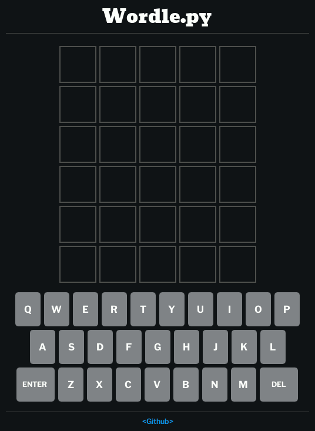

    

# Wordle.py

Simple Python clone of the web-based game _[Wordle](https://www.nytimes.com/games/wordle/index.html)_ by Josh Wardle, created using _[dearpygui](https://github.com/hoffstadt/DearPyGui)_ framework.

    

## How to use

1.  Clone or download the repository

        git clone https://github.com/j-zunino/Wordle.py

2.  Go to the folder

        cd Wordle.py

3.  Install dearpygui

        pip install dearpygui

4.  Run main.py

        python main.py

## To-do

- Error handling
- Spanish translation
- Rework functions.py

## Credits

- Original game: https://www.nytimes.com/games/wordle/index.html
- Word list: https://gist.github.com/dracos/dd0668f281e685bad51479e5acaadb93
- Bug fix solution: https://github.com/pixegami/python-wordle
- Fonts:
  - https://fonts.google.com/specimen/Bevan
  - https://fonts.google.com/specimen/Libre+Franklin
